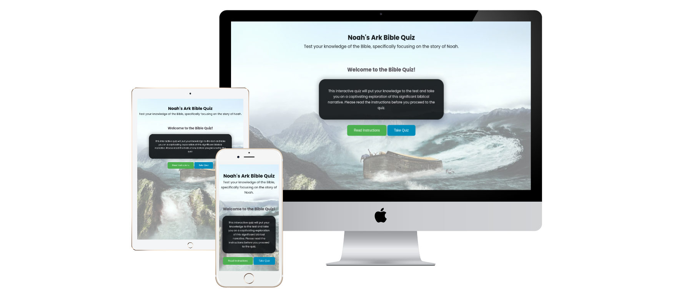

Live Web Application URL: https://msamarpanraj.github.io/noah-ark-quiz/index.html

## Table of contents:

- [Project Goals](#project-goals)
  - [User Goals](#user-goals)
- [User Experience](#user-experience)
    - [Developer Goals](#developer-goals)
    - [Visitor Goals](#visitor-goals)
  - [User Experience](#user-experience-1)
    - [User Stories](#user-stories)
  - [Design](#design)
    - [Wireframes](#wireframes)
  - [Technology](#technology)
    - [Languages](#languages)
    - [Frameworks \& Tools](#frameworks--tools)
  - [Testing](#testing)
    - [Accessibility](#accessibility)
    - [Lighthouse Testing](#lighthouse-testing)
    - [Validator Testing](#validator-testing)
  - [Manual testing](#manual-testing)
    - [Fixed bugs](#fixed-bugs)
    - [Unfixed bugs](#unfixed-bugs)
    - [Supported screens and browsers](#supported-screens-and-browsers)
      - [Supported Screens](#supported-screens)
      - [Supported Browsers](#supported-browsers)
  - [Deployment](#deployment)
    - [Version Control](#version-control)
    - [Steps to deply website to Github Pages](#steps-to-deply-website-to-github-pages)
    - [Deploying the Website to GitHub Pages](#deploying-the-website-to-github-pages)
    - [Steps for cloning the repository](#steps-for-cloning-the-repository)
    - [Cloning the Repository](#cloning-the-repository)
    - [Forking the Repository](#forking-the-repository)
- [Credits](#credits)
  - [Images/Content](#imagescontent)
  - [Favicon](#favicon)
  - [Other](#other)
  - [Educational resources](#educational-resources)
- [Acknowledgements](#acknowledgements)

## Project Background:

The Bible Quiz Project is an interactive web application designed to educate and engage users with questions related to the Bible. This project was created as a part of a Code Institute’s Diploma in Web Application Development Course to showcase proficiency in web development technologies, including HTML, CSS, and JavaScript.

Throughout the development of this quiz I followed the principles of User Experience (UX), including the 5 planes of Strategy, Scope, Structure, Skeleton & Surface. At all times I wanted to make sure that the website was easy to use, responsive, accessible and intuitive as well as meeting the goals and needs of the user and client.

### Key Factors

The Bible Quiz App is driven by several key factors:

- **Educational Significance:** The project aims to serve as an educational resource, making it possible for users to engage with the story of Noah's Ark in a meaningful and educational manner. It supports the pursuit of biblical literacy and a deeper understanding of this iconic narrative.

- **Interactive Learning:** By providing a quiz format, the project encourages interactive learning. Users can actively participate in the learning process, which can be more engaging and effective compared to passive learning methods.

- **Skill Showcase:** This project serves as a platform to demonstrate web development skills, including proficiency in HTML, CSS, and JavaScript. It represents the ability to design and create interactive web applications, an essential skill in today's digital landscape.

- **User Engagement:** User engagement is a central factor. The incorporation of limited attempts, immediate feedback, a time limit for questions, and question tracking is aimed at motivating users to actively participate and challenge their biblical knowledge.

- **Measurement and Reporting:** The application provides a means for users to measure their knowledge and progress. Users can track the number of questions attempted, the number of correct answers and their overall score.

- **User-Friendly Design:** The user experience and interface design are critical factors. The project prioritizes a user-friendly and intuitive design to ensure accessibility and ease of use for a broad user base, including those with varying levels of technological familiarity.

The Bible Quiz App is a project that blends educational significance with technical skill demonstration while ensuring an engaging and user-friendly experience for participants.

# Project Goals

## User Goals

The Bible Quiz App is designed with a focus on fulfilling the following user goals:

1. Users aim to engage with the Bible and the story of Noah's Ark in an educational and interactive manner. The primary goal is to enhance their knowledge of this biblical narrative.

2. Participants seek opportunities to actively engage with the content, answering questions and receiving immediate feedback whether the option they choose is right or wrong, which is often more engaging and effective compared to passive learning.

3. Users wish to gauge and assess their knowledge of the Bible. They aim to test their understanding of the story of Noah's Ark, gain insights into their proficiency, and identify areas for improvement.

4. User goals also include a user-friendly and intuitive experience. The project aims to provide an accessible and enjoyable platform for individuals with varying levels of technological familiarity.

5. Users aspire to engage in an interactive challenge. The incorporation of limited attempts, a time limit for questions, and immediate feedback adds an element of challenge and excitement to the learning experience.

By aligning with these user goals, the Noah's Ark Bible Quiz App aims to fulfill the educational and engagement needs of its participants while providing an enjoyable and user-friendly learning platform.

# User Experience

### Developer Goals

As a developer, I would like the website to provide a user-friendly and engaging platform for individuals interested in testing their knowledge of the Bible, specifically focusing on the story of Noah's Ark. The project aims to deliver an interactive learning experience by incorporating various features, such as limited attempts, question tracking, and time-limited questions. It serves as an educational tool for individuals looking to enhance their understanding of this significant biblical narrative.

### Visitor Goals

As a visitor, I would like the website to:

- be easy to understand
- be easy to navigate
- be able to use the quiz on a variety of devices
- enable me to learn about Noah's Ark and test my knowledge on the significant biblical narrative.

## User Experience

### User Stories

- First time visitor goals:

  - As a first time visitor, I would like to be able to find out what the site is about.
  - As a first time visitor, I would like to know what the quiz is about and how to play it.
  - As a first time visitor, I would like to read the instructions of the quiz.
  - As a first time visitor, I would like to take part in the quiz and get my results to see how well I did.

- Returning visitor goals:

  - As a returning visitor, I would like to try the quiz again to see if I can get a better score.
  - As a returning visitor, I would like to be able to remember the Noah's Ark related questions that were presented and improve bible knowledge.

- Frequent visitor goals:
  - As a frequent visitor, I would like to keep testing my knowledge on Noah's Ark and get a better score each time.

## Design

### Wireframes

## Technology

### Languages

- HTML
- CSS
- Javascript

### Frameworks & Tools

## Testing

### Accessibility

### Lighthouse Testing

### Validator Testing

## Manual testing

### Fixed bugs

### Unfixed bugs

### Supported screens and browsers

#### Supported Screens

- iPhone SE, 375px wide. Site developed with mobile first approach so it looks fine even with 320px wide.
- iPad Mini, 768px wide
- Google Nest Hub Max, 1280px wide

#### Supported Browsers

- Chrome
- Edge
- Firefox
- Safari
- Opera

## Deployment

### Version Control

### Steps to deply website to Github Pages

### Deploying the Website to GitHub Pages

### Steps for cloning the repository

### Cloning the Repository

### Forking the Repository

# Credits

## Images/Content

## Favicon

## Other

## Educational resources

# Acknowledgements
