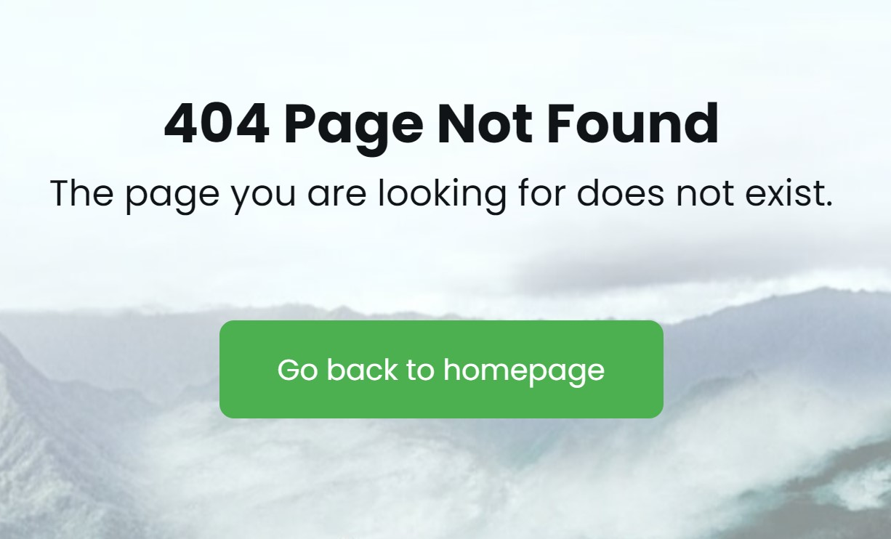
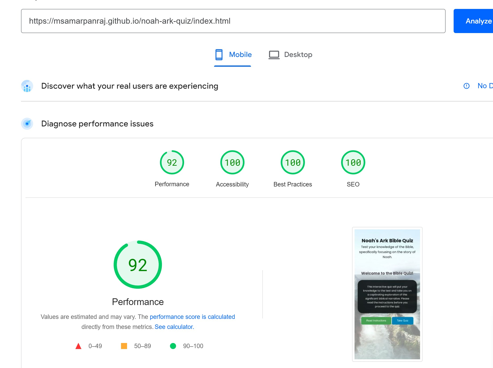

Live Web Application URL: https://msamarpanraj.github.io/noah-ark-quiz/index.html

## Table of contents:

- [Project Background:](#project-background)
    - [Key Factors](#key-factors)
- [Project Goals](#project-goals)
  - [User Goals](#user-goals)
- [User Experience](#user-experience)
    - [Developer Goals](#developer-goals)
    - [Visitor Goals](#visitor-goals)
    - [User Stories](#user-stories)
  - [Design](#design)
    - [Structure](#structure)
  - [Design Choices](#design-choices)
    - [Fonts](#fonts)
    - [Colours](#colours)
    - [Imagery](#imagery)
  - [Wireframes](#wireframes)
    - [Welcome Screen](#welcome-screen)
    - [Quiz Area](#quiz-area)
    - [Result Area](#result-area)
- [Features](#features)
    - [Existing Features](#existing-features)
    - [Features Left to Implement](#features-left-to-implement)
- [Testing](#testing)
    - [Lighthouse Testing](#lighthouse-testing)
    - [Validator Testing](#validator-testing)
      - [HTML](#html)
      - [CSS](#css)
      - [Javascript](#javascript)
    - [Unfixed Bugs](#unfixed-bugs)
  - [Manual testing](#manual-testing)
    - [User stories tests](#user-stories-tests)
    - [Functionality](#functionality)
- [Technology](#technology)
    - [Languages](#languages)
    - [Tools](#tools)
    - [Supported screens and browsers](#supported-screens-and-browsers)
      - [Supported Screens](#supported-screens)
      - [Supported Browsers](#supported-browsers)
- [Deployment](#deployment)
    - [Version Control](#version-control)
    - [Steps to deply website to Github Pages](#steps-to-deply-website-to-github-pages)
    - [Deploying the Website to GitHub Pages](#deploying-the-website-to-github-pages)
    - [Steps for cloning the repository](#steps-for-cloning-the-repository)
    - [Cloning the Repository](#cloning-the-repository)
    - [Forking the Repository](#forking-the-repository)
- [Credits](#credits)
  - [Images/Content](#imagescontent)
  - [Favicon](#favicon)
  - [Other](#other)
  - [Educational resources](#educational-resources)
- [Acknowledgements](#acknowledgements)

# Project Background:

The Bible Quiz Project is an interactive web application designed to educate and engage users with questions related to the Bible. This project was created as a part of a Code Institute’s Diploma in Web Application Development Course to showcase proficiency in web development technologies, including HTML, CSS, and JavaScript.

Throughout the development of this quiz I followed the principles of User Experience (UX), including the 5 planes of Strategy, Scope, Structure, Skeleton & Surface. At all times I wanted to make sure that the website was easy to use, responsive, accessible and intuitive as well as meeting the goals and needs of the user and client.

### Key Factors

The Bible Quiz App is driven by several key factors:

- **Educational Significance:** The project aims to serve as an educational resource, making it possible for users to engage with the story of Noah's Ark in a meaningful and educational manner. It supports the pursuit of biblical literacy and a deeper understanding of this iconic narrative.

- **Interactive Learning:** By providing a quiz format, the project encourages interactive learning. Users can actively participate in the learning process, which can be more engaging and effective compared to passive learning methods.

- **Skill Showcase:** This project serves as a platform to demonstrate web development skills, including proficiency in HTML, CSS, and JavaScript. It represents the ability to design and create interactive web applications, an essential skill in today's digital landscape.

- **User Engagement:** User engagement is a central factor. The incorporation of limited attempts, immediate feedback, a time limit for questions, and question tracking is aimed at motivating users to actively participate and challenge their biblical knowledge.

- **Measurement and Reporting:** The application provides a means for users to measure their knowledge and progress. Users can track the number of questions attempted, the number of correct answers and their overall score.

- **User-Friendly Design:** The user experience and interface design are critical factors. The project prioritizes a user-friendly and intuitive design to ensure accessibility and ease of use for a broad user base, including those with varying levels of technological familiarity.

The Bible Quiz App is a project that blends educational significance with technical skill demonstration while ensuring an engaging and user-friendly experience for participants.

# Project Goals

## User Goals

The Bible Quiz App is designed with a focus on fulfilling the following user goals:

1. Users aim to engage with the Bible and the story of Noah's Ark in an educational and interactive manner. The primary goal is to enhance their knowledge of this biblical narrative.

2. Participants seek opportunities to actively engage with the content, answering questions and receiving immediate feedback whether the option they choose is right or wrong, which is often more engaging and effective compared to passive learning.

3. Users wish to gauge and assess their knowledge of the Bible. They aim to test their understanding of the story of Noah's Ark, gain insights into their proficiency, and identify areas for improvement.

4. User goals also include a user-friendly and intuitive experience. The project aims to provide an accessible and enjoyable platform for individuals with varying levels of technological familiarity.

5. Users aspire to engage in an interactive challenge. The incorporation of limited attempts, a time limit for questions, and immediate feedback adds an element of challenge and excitement to the learning experience.

By aligning with these user goals, the Noah's Ark Bible Quiz App aims to fulfill the educational and engagement needs of its participants while providing an enjoyable and user-friendly learning platform.

# User Experience

### Developer Goals

As a developer, I would like the website to provide a user-friendly and engaging platform for individuals interested in testing their knowledge of the Bible, specifically focusing on the story of Noah's Ark. The project aims to deliver an interactive learning experience by incorporating various features, such as limited attempts, question tracking, and time-limited questions. It serves as an educational tool for individuals looking to enhance their understanding of this significant biblical narrative.

### Visitor Goals

As a visitor, I would like the website to:

- be easy to understand
- be easy to navigate
- be able to use the quiz on a variety of devices
- enable me to learn about Noah's Ark and test my knowledge on the significant biblical narrative.

### User Stories

- First time visitor goals:

  - As a first time visitor, I would like to be able to find out what the site is about.
  - As a first time visitor, I would like to know what the quiz is about and how to play it.
  - As a first time visitor, I would like to read the instructions of the quiz.
  - As a first time visitor, I would like to take part in the quiz and get my results to see how well I did.
  - I am looking for a easy to navigate test the is responsive and easy to interact with on all devices.
  - As a first time visitor, I would like to see the question number and timer at the top of the quiz area.
  - As a first time visitor, I would like to see question being asked along with 4 possible answers.
  - As a first time visitor, I would like to see if the option I choose is correct by showing the answer correct answer in green and incorrect in red.
  - As a first time visitor, I would like to see next and previous buttons under the options to navigate through the questions.
  - As a first time visitor, I would like to see results window at the end once all the questions are answered.
  - As a first time visitor, I would like to restart the quiz and play again.

- Returning visitor goals:

  - As a returning visitor, I would like to try the quiz again to see if I can get a better score.
  - As a returning visitor, I would like to be able to remember the Noah's Ark related questions that were presented and improve bible knowledge.

- Frequent visitor goals:
  - As a frequent visitor, I would like to keep testing my knowledge on Noah's Ark and get a better score each time.

## Design

### Structure

The website consists of 2 pages (index.html and 404.html) which both have a consistent structure and design. The background image was taken from pixabay.com and the image is closely related to the Noah's Ark as you can see the Ark during floods. The main goal is to test a user's knowledge on Noah's Ark.

## Design Choices

### Fonts

I have chosen Poppins font from google fonts for the website as I feel this is a clean looking font.

### Colours

The colour scheme for the website came from the background image, which was sourced from pixabay. Additional colors were generated to compliment the website design and highlight the buttons as they are very important on the site from coolors.co

### Imagery

The background image on index.html and 404.html is a picture of the Noah's Ark as this is the theme of the quiz, it features the Ark floating in the ocean. This was sourced from [Pixabay](https://pixabay.com/photos/noahs-ark-ship-animals-art-flood-3008693/)

## Wireframes

The wireframes were created using Balsamiq.

### Welcome Screen

### Quiz Area

### Result Area

# Features

The quiz is just a one page website excluding 404 page. All the functionality of website will run through JavaScript. The page has been designed to be responsive.

### Existing Features

- **Favicon:**

  - The site has a favicon which is displays in the web browser.

    

- **404 page:**

  - If a user goes to a non-existent page, a 404 page is displayed which directs the user back to the quiz home page.
    

- **Header Text:**

  - Header Text is static and stays visible on the page throughout the duration of the quiz.
    

- **Intro Text:**

  - Header Text displays on the welcome screen from there user can click on read instructions or take quiz.
    

- **Instructions List:**

  - List of instructions user can read before they start the quiz.
    

- **Interactive Question Display:**

  - Each question is presented one at a time, allowing users to focus on their current challenge. The questions are designed to cater to a range of knowledge levels, making the quiz suitable for a wide audience.
    

- **Timed Responses:**

  - Each question comes with a 15-second timer, adding an element of urgency and making the quiz more exciting.
    

- **Answer Selection and Validation:**

  - Users can select their answers from multiple-choice options. The quiz provides immediate feedback on whether the selected answer is correct or incorrect, enhancing the learning experience.
    
    

- **Navigation Controls:**
  - Users can navigate between questions using 'Next' and 'Previous' buttons, offering a seamless quiz experience.

### Features Left to Implement

- **Quiz Customization:**
  - Future versions could include options for users to select different difficulty levels or focus on specific aspects of the Noah's Ark story.

# Testing

### Lighthouse Testing

**Desktop**

**Mobile**

### Validator Testing

- HTML, CSS, and JavaScript code have been validated using standard validators, ensuring code quality and standard compliance.

#### HTML

- HTML validation conducted using the W3C validator of the project. The results of the testing, along with screenshots are as follows:
  

#### CSS

- CSS validation conducted using W3C CSS Validator.
  

#### Javascript

- Javascript validation conducted using the JShint. Few errors were detected and were resolved. Howevr one warning error was not fixed, tried multiple fixes.
  

### Unfixed Bugs

- Javascript validation conducted using the JShint. Few errors were detected and were resolved. Howevr one warning error was not fixed, tried multiple fixes.

## Manual testing

### User stories tests

| User Story                                                                                                                   | Outcome                                                                                                   | Result |
| ---------------------------------------------------------------------------------------------------------------------------- | --------------------------------------------------------------------------------------------------------- | ------ |
| As a first-time visitor, I would like to find out what the site is about                                                     | As a first-time visitor, I can understand the purpose of the quiz website based on Noah's Ark Bible story | PASS   |
| As a first-time visitor, I want to know what the quiz is about and how to play it                                            | As a first-time visitor, I can easily discover the quiz's focus and instructions on how to play           | PASS   |
| As a first-time visitor, I want to read the instructions of the quiz                                                         | As a first-time visitor, I can access and understand the instructions before proceeding to the quiz       | PASS   |
| As a first-time visitor, I want to take part in the quiz and get my results                                                  | As a first-time visitor, I can start the quiz, answer questions, and view my results at the end           | PASS   |
| As a first-time visitor, I am looking for an easy-to-navigate test that is responsive on all devices                         | As a first-time visitor, I can navigate the quiz easily, and the quiz is responsive across devices        | PASS   |
| As a first-time visitor, I want to see the question number and timer at the top of the quiz area                             | As a first-time visitor, I can easily track the question number and time while taking the quiz            | PASS   |
| As a first-time visitor, I want to see the question being asked along with four possible answers                             | As a first-time visitor, questions and answer options are presented clearly and legibly                   | PASS   |
| As a first-time visitor, I want to see if the option I choose is correct by showing the answer in green and incorrect in red | As a first-time visitor, I receive visual feedback on the correctness of my selected answer               | PASS   |
| As a first-time visitor, I want to see next and previous buttons under the options to navigate through the questions         | As a first-time visitor, I can easily navigate between questions using next and previous buttons          | PASS   |
| As a first-time visitor, I want to see a results window at the end once all the questions are answered                       | As a first-time visitor, I can view a results window summarizing my performance at the end of the quiz    | PASS   |
| As a first-time visitor, I want to restart the quiz and play again                                                           | As a first-time visitor, I can restart the quiz after completion to play again                            | PASS   |

### Functionality

| Feature                  | Expected Outcome                                                                                | Action                                  | Result |
| ------------------------ | ----------------------------------------------------------------------------------------------- | --------------------------------------- | ------ |
| Take Quiz Button         | When clicked, it initiates the quiz                                                             | Clicked the "Take Quiz" button          | PASS   |
| Read Instructions Button | When clicked, it displays clear instructions on how to play the quiz                            | Clicked the "Read Instructions" button  | PASS   |
| Wrong Answer Option      | When clicked, it reveals the correct answer                                                     | Clicked the option for a wrong answer   | PASS   |
| Correct Answer Option    | When clicked, it confirms that the chosen answer is correct                                     | Clicked the option for a correct answer | PASS   |
| Prev Button              | When clicked, it displays the previous question                                                 | Clicked an prev button                  | PASS   |
| Next Question Button     | When clicked, it shows the next question and answers.                                           | Clicked the "Next" button               | PASS   |
| Finish Button            | On the last question, when clicked, it shows the quiz results                                   | Clicked the "Finish" button             | PASS   |
| Page Not Found Page      | Entering an incorrect web page address produces a 404 page guiding users back to the index page | Visited a non-existent page             | PASS   |

# Technology

### Languages

- HTML
- CSS
- Javascript

### Tools

- [Git](https://git-scm.com/)
  - Git was used for version control (commit to Git and push to GitHub).
- [GitHub](https://github.com/)
  - Used to store, host and deploy the project files and source code after being pushed from Git.
- [Codeanywhere](https://www.codeanywhere.com)
  - An online IDE linked to the GitHub repository used to write my code.
- [Google fonts](https://fonts.google.com/)
  - Used to compare and choose fonts.
- [Coolors](https://coolors.co/)
  - Used to research and choose the colour scheme by comparing and contrasting similar colours in the generator.
- [Favicons](https://favicon.io/)
  - Used to generate a favicon for the website title.
- [Lighthouse](https://developers.google.com/web/tools/lighthouse)
  - Used to audit the site for quality and ensure responsiveness.
- [Websitemockupgeenerator](https://websitemockupgenerator.com/)
  - An online tool to generate website mockup.
- [tinypng](https://tinypng.com/)
  - Used to reduce the size of the images for better user experience.
- [JSHint](https://jshint.com/)
  - Used to detect errors in the JavaScript files

### Supported screens and browsers

#### Supported Screens

- iPhone SE, 375px wide. Site developed with mobile first approach so it looks fine even with 320px wide.
- iPad Mini, 768px wide
- Google Nest Hub Max, 1280px wide

#### Supported Browsers

- Chrome
- Edge
- Firefox
- Safari
- Opera

# Deployment

### Version Control

The site was created using the CodeAnywhere code editor and which was connected to github. A new workspace is imported to codeanywhere from github repositories and the following is the repository which this project was associated.
<https://github.com/msamarpanraj/noah-ark-quiz>

During development, the following Git commands were utilized to manage code updates:

`git add <file>` - This command added specific file(s) to the staging area for the next commit.
`git commit -m “commit message”` - It was used to commit changes to the local repository, preparing them for the final step.
`git push` - This command pushed all committed code to the remote repository on GitHub.

### Steps to deply website to Github Pages

### Deploying the Website to GitHub Pages

- The website was deployed to GitHub Pages using the following steps:
- In the GitHub repository, go to the "Settings" tab.
- From the left-side menu, select 'Pages.'
- In the source section drop-down menu, choose the 'main' branch.
- Click 'Save.'
- Upon successful publishing, a live link will be displayed in a green banner.

### Steps for cloning the repository

1. Click on the "Code" button near the top right corner of the page.
2. Copy the HTTPS or SSH URL that appears in the box.
3. Open your terminal (or Git Bash on Windows) and navigate to the directory where you want to clone the repository.
4. Type "git clone" followed by a space, and then paste the URL you copied in step 3.
5. Press enter to run the command. This will clone the repository onto your local machine.
6. You should now have a local copy of the GitHub repository on your machine.

### Cloning the Repository

1. To clone the repository to your local machine, follow these steps:

- Click on the "Code" button located near the top right corner of the page.
- Copy the HTTPS or SSH URL displayed.
- Open your terminal (or Git Bash on Windows) and navigate to your desired directory.
- Enter "git clone" followed by a space, and paste the copied URL.
- Press enter to execute the command, creating a local copy of the GitHub repository.

2. You now have the GitHub repository cloned to your local machine.

### Forking the Repository

1. Fork the repository by following these steps:

2. Click the "Fork" button found near the top right corner of the page. This duplicates the repository into your GitHub account.
3. After forking, you will be redirected to your forked repository.
4. If not already done, clone the forked repository to your local machine, using the instructions mentioned earlier.
5. Make any desired changes or additions to the code in your local copy of the repository.
6. Commit your changes to your local repository using the "git commit" command.
7. Push your changes to the forked repository on GitHub with the "git push" command.
8. If you intend to contribute your changes back to the original repository, initiate a pull request. You can do this by going to the original repository's page and selecting the "New pull request" button. From there, you can compare your changes to the original repository and request a merge.
9. You now have a forked copy of the GitHub repository in your account, allowing you to make changes and contribute back to the original repository if desired.

# Credits

## Images/Content

- <https://pixabay.com/photos/noahs-ark-ship-animals-art-flood-3008693/>
- <https://pixabay.com/illustrations/jesus-christ-god-holy-spirit-4779545/>

## Favicon

- [Favicon Generator](https://favicon.io)

## Other

- Colour palette [Paletton](https://coolors.co)
- SVG icons: [SVGRepo](svgrepo.com)
- Fonts: [Google Fonts](https://fonts.google.com/)

## Educational resources

- [Js30](https://javascript30.com/)
- [W3Schools](https://www.w3schools.com/)
- [Youtube](https://youtube.com)

# Acknowledgements

I successfully finished this project as part of my Portfolio Project 2 submission for the Full Stack Web Developer (eCommerce) Diploma program at the Code Institute. I extend my heartfelt appreciation to my mentors, as well as the entire Code Institute team and the supportive Slack community for their invaluable assistance and encouragement during the course of this project.
